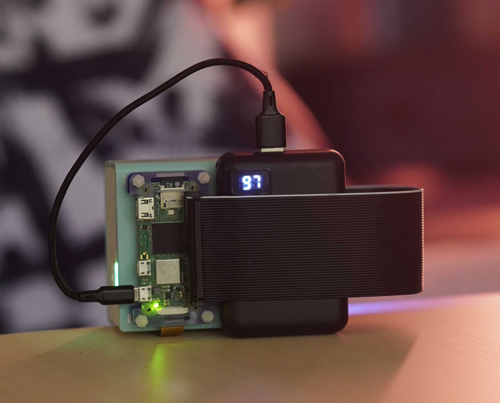
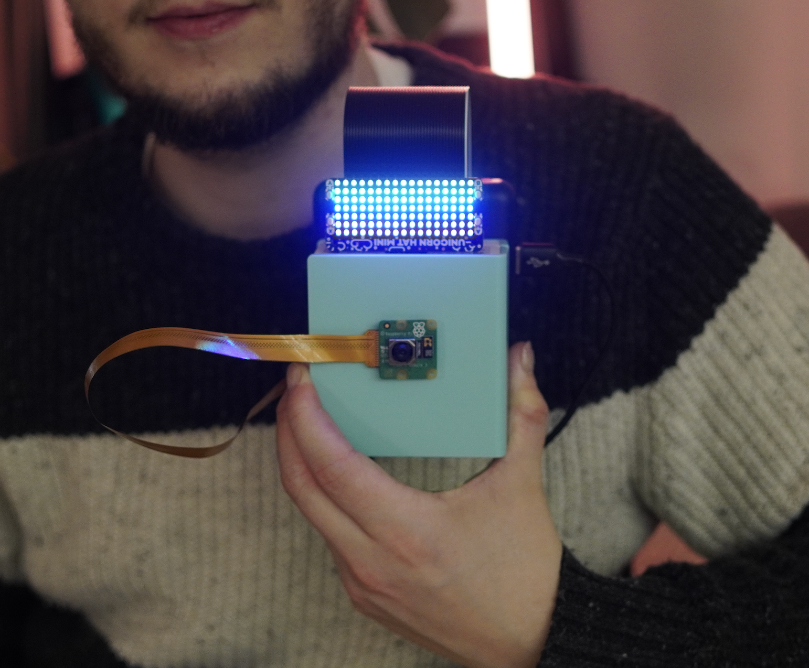
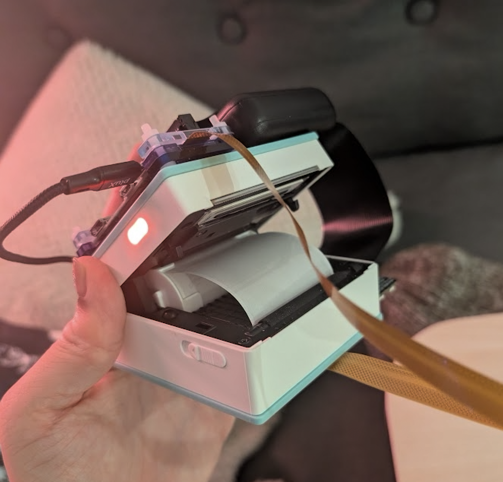
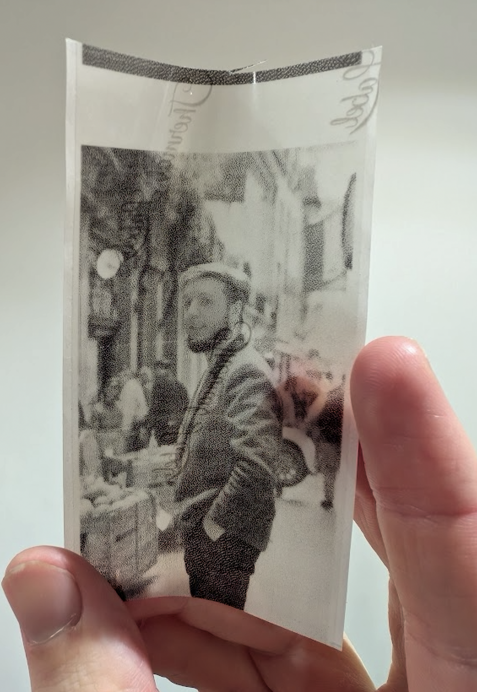
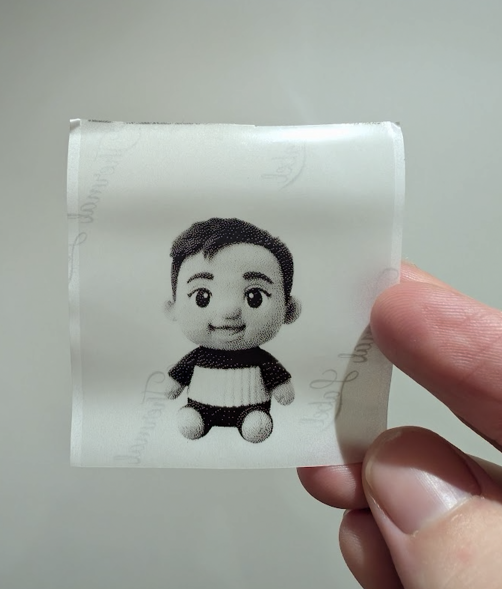
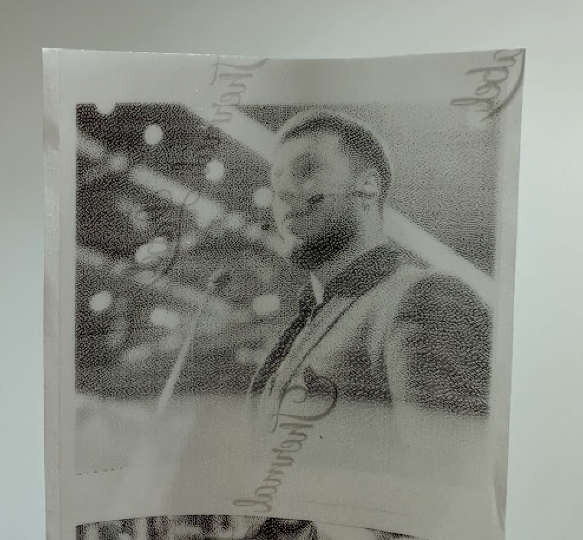
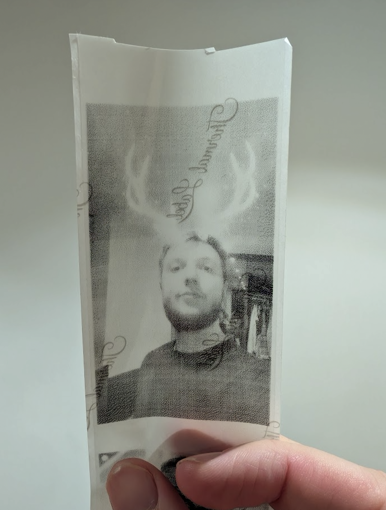

# Mini Soul-Reading-Device-3000
Mini Soul Reading Device! Point it at someone and it'll show you their spirit animal. Or their plushy version, and more.
I built this to give an analog feel to something that is traditionally digital: image-to-image diffusion models.

Built using a Raspberry Pi Zero with a camera to take photos.
The photos are processed in the cloud, modified, then converted to bytes and sent to the printer.

Hardest part was getting the printer to work, using someone's packet sniffing solution (Reverse-engineered from the Phonemo app) I could send arbitrary photos to the printer via bluetooth from the Raspberry Pi.

#### Spirit Animal Mode
Generating your spirit animal: An LLM is asked what spirit animal you look like. It forms a prompt, passes it to Nano Banana.

#### Ted Talk Mode
The soul reader reaches into a parallel universe where you are giving a Ted Talk...

#### Plushify Mode
Uses a plushy-trained model. One day I'll push it into an image->3D model like Meshy and print my own plushy.

#### 1920s London
The soul reader reaches into a parallel universe where it's you 100 years in the past in Camden, London.

## Parts
- Raspberry Pi Zero 2
- Phonomo Printer
- Raspberry Pi Camera Module 3
- Unicorn Hat (LED Display)
- Power Bank

### Back View

### Holding the Device

### Device Open

---

## Interactions

### Choosing Modes

### Taking a Photo

### Printing Result

---

## Prints
<table align="center">
  <tr>
    <td align="center">
      
    </td>
    <td align="center">
      
    </td>
  </tr>
  <tr>
    <td align="center">
      
    </td>
    <td align="center">
      
    </td>
  </tr>
</table>
